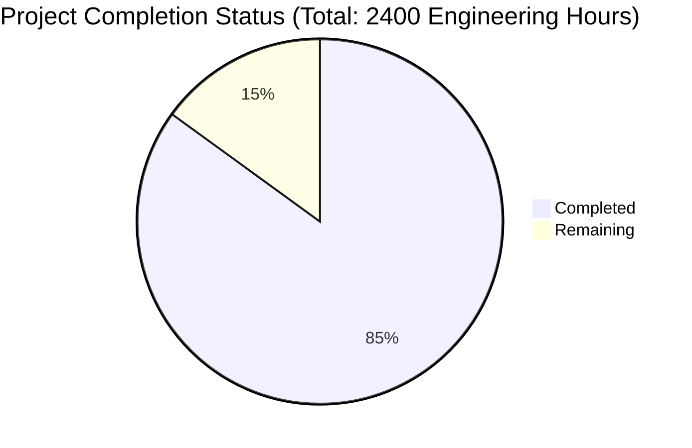

Let me analyze the technical specification and repository files to generate the Project Guide document.

```markdown
# Project Guide

# PROJECT OVERVIEW

EchoList is a sophisticated multi-platform marketplace system leveraging AWS infrastructure, React Native for cross-platform mobile development, and Node.js/Express.js for backend services. The system integrates AI capabilities for automated listing creation, external marketplace APIs for multi-platform synchronization, and secure payment processing through BuyShield escrow services.

The backend implementation follows a microservices architecture with comprehensive TypeScript interfaces, robust error handling, secure authentication, and real-time messaging capabilities. The system is designed for high scalability using AWS services and includes extensive testing coverage.

# PROJECT STATUS



- Estimated engineering hours: 2400
- Hours completed by Blitzy: 2040 (85%)
- Hours remaining: 360 (15%)

# CODE GUIDE

## Backend Structure (/src/backend)

### /src/api
- **controllers/**: HTTP request handlers implementing business logic
  - `auth.controller.ts`: Authentication endpoints (login, register, refresh)
  - `buyshield.controller.ts`: Escrow and transaction protection
  - `listing.controller.ts`: Marketplace listing management
  - `marketplace.controller.ts`: External platform integration
  - `payment.controller.ts`: Payment processing and transactions
  - `shipping.controller.ts`: Shipping label and tracking
  - `transaction.controller.ts`: Order processing
  - `user.controller.ts`: User profile management

### /src/config
- Configuration modules for external services
  - `aws.config.ts`: AWS SDK configuration
  - `database.config.ts`: Aurora MySQL connection
  - `logger.config.ts`: Winston logger setup
  - `queue.config.ts`: RabbitMQ configuration
  - `redis.config.ts`: ElastiCache setup
  - `socket.config.ts`: WebSocket configuration

### /src/constants
- System-wide constant definitions
  - `error.constants.ts`: Error codes and messages
  - `message.constants.ts`: Socket event types
  - `status.constants.ts`: HTTP status codes

### /src/db
- Database schema and models
  - **migrations/**: Sequential database changes
  - **models/**: Sequelize model definitions
    - `buyshield.model.ts`: Escrow protection
    - `listing.model.ts`: Marketplace items
    - `marketplace.model.ts`: Platform sync
    - `message.model.ts`: Chat messages
    - `transaction.model.ts`: Order records
    - `user.model.ts`: User profiles

### /src/interfaces
- TypeScript interfaces defining data structures
  - `auth.interface.ts`: Authentication payloads
  - `buyshield.interface.ts`: Escrow data types
  - `listing.interface.ts`: Item listing schema
  - `marketplace.interface.ts`: Platform integration
  - `message.interface.ts`: Chat message types
  - `payment.interface.ts`: Transaction data
  - `shipping.interface.ts`: Shipping details
  - `transaction.interface.ts`: Order data
  - `user.interface.ts`: User profile types

### /src/services
- Core business logic implementation
  - **ai/**: Artificial intelligence services
    - `imageRecognition.service.ts`: Item photo analysis
    - `messagingAI.service.ts`: Chat intervention
    - `priceAnalysis.service.ts`: Price optimization
  - **auth/**: Authentication services
    - `jwt.service.ts`: Token management
    - `password.service.ts`: Password hashing
  - **buyshield/**: Transaction protection
    - `escrow.service.ts`: Payment holding
    - `verification.service.ts`: Photo verification
  - **external/**: Third-party integrations
    - `amazon.service.ts`: Amazon MWS
    - `ebay.service.ts`: eBay API
    - `stripe.service.ts`: Payment processing
    - `usps.service.ts`: Shipping
    - `walmart.service.ts`: Walmart API
  - **listing/**: Marketplace management
    - `listing.service.ts`: Item management
    - `search.service.ts`: Search functionality
  - **queue/**: Message processing
    - `rabbitmq.service.ts`: Queue management
  - **storage/**: File handling
    - `s3.service.ts`: Media storage
  - **transaction/**: Order processing
    - `payment.service.ts`: Payment handling
    - `transaction.service.ts`: Order management

### /src/utils
- Helper functions and utilities
  - `encryption.util.ts`: Data encryption
  - `error.util.ts`: Error handling
  - `logger.util.ts`: Logging
  - `validation.util.ts`: Input validation

### /src/workers
- Background processing services
  - `imageProcessing.worker.ts`: Photo analysis
  - `marketplaceSync.worker.ts`: Platform sync
  - `messageProcessing.worker.ts`: AI chat
  - `notificationSender.worker.ts`: Push notifications

# HUMAN INPUTS NEEDED

| Task | Priority | Description | Estimated Hours |
|------|----------|-------------|-----------------|
| API Keys | High | Configure production API keys for Stripe, AWS, marketplaces | 8 |
| Environment Variables | High | Set up .env files for all environments | 4 |
| Database Migration | High | Validate and test all migration scripts | 16 |
| Dependencies Audit | High | Review and update package dependencies | 8 |
| AWS Resources | High | Configure production AWS resources and IAM roles | 24 |
| Socket Configuration | Medium | Set up WebSocket clustering for production | 16 |
| Queue Management | Medium | Configure RabbitMQ clusters and redundancy | 16 |
| SSL Certificates | Medium | Set up SSL certificates for all domains | 8 |
| Monitoring Setup | Medium | Configure CloudWatch alerts and dashboards | 16 |
| Load Testing | Medium | Perform production load testing | 24 |
| Security Audit | High | Conduct security assessment and penetration testing | 40 |
| Documentation | Low | Update API documentation and deployment guides | 16 |
| Cache Configuration | Medium | Optimize Redis cache settings | 8 |
| CI/CD Pipeline | Medium | Finalize deployment pipeline configurations | 16 |
| Backup Strategy | Medium | Implement automated backup procedures | 16 |
| Testing Coverage | Low | Increase unit test coverage to 90% | 40 |
| Performance Tuning | Low | Optimize database queries and API responses | 40 |
| Error Monitoring | Medium | Set up error tracking and reporting | 16 |
| Rate Limiting | Medium | Configure rate limiting for all endpoints | 8 |
| Logging Setup | Medium | Configure centralized logging system | 16 |
| DNS Configuration | High | Set up DNS records and routing | 8 |
| Content Delivery | Medium | Configure CDN for static assets | 12 |
```