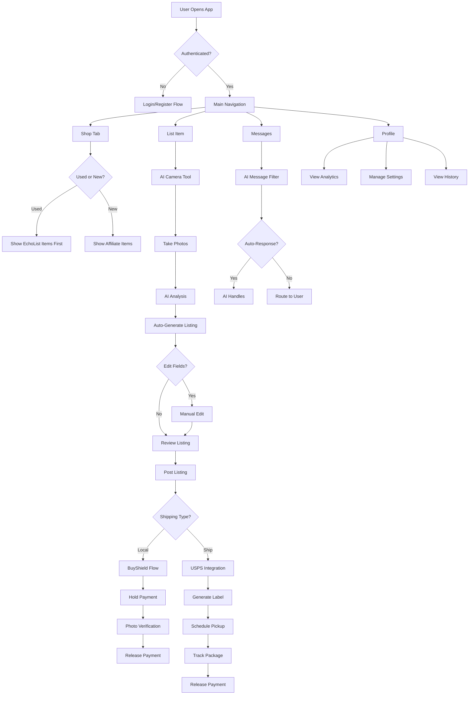
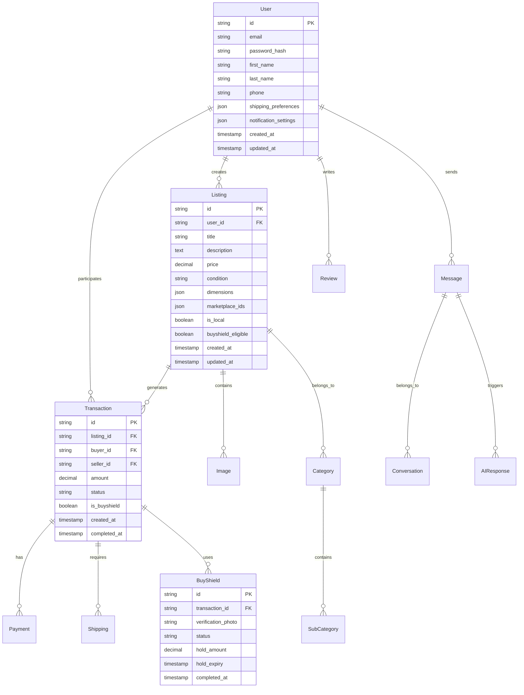
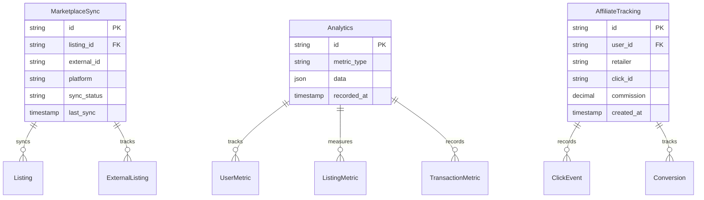
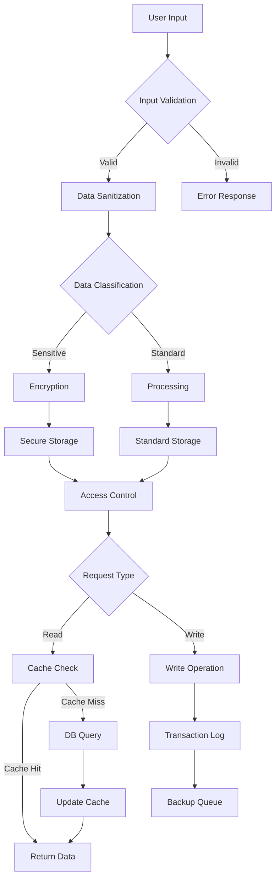
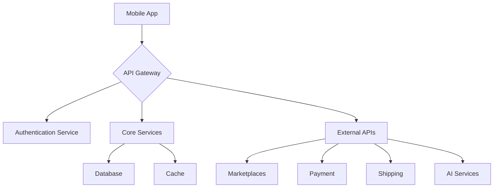

1. Introduction
1.1 Purpose
This Software Requirements Specification (SRS) document provides a comprehensive description of the EchoList multi-platform marketplace system. It details the functional and non-functional requirements for developers, system architects, QA engineers, and project stakeholders involved in the development and implementation of the platform. The document serves as the primary reference for technical requirements and system behavior throughout the development lifecycle.

1.2 Scope
EchoList is an AI-powered marketplace platform that revolutionizes online buying and selling through:

- Multi-platform Integration: Seamless integration with major e-commerce platforms (eBay, Amazon, Walmart, etc.) while maintaining its own proprietary marketplace
- Dual-Tab Interface: Separate 'Used' and 'New' item sections providing distinct shopping experiences
- AI-Powered Features: 
  - Automated listing creation and categorization
  - Image recognition and dimension estimation
  - Smart messaging intervention
  - Fraud detection and risk assessment
- BuyShield Protection: Secure escrow service for local pickup transactions
- Unified Management: Centralized inventory, shipping, and transaction management across platforms
- Advanced Analytics: Real-time market insights and performance metrics
- Social Integration: Direct listing sharing to social media platforms
- Affiliate Revenue System: Backend integration with major retailers

The platform aims to simplify the selling process for everyday users while maximizing item exposure and enhancing buyer-seller trust through AI-driven automation and security features. The system will be built using React Native for the frontend, Node.js/Express.js for the backend, AWS infrastructure for hosting, and integrate with multiple third-party APIs for payments, shipping, and marketplace functionality.

2. PRODUCT DESCRIPTION

2.1 PRODUCT PERSPECTIVE
EchoList operates as a comprehensive marketplace integration platform within the broader e-commerce ecosystem. The system:

- Functions as a centralized hub connecting multiple external marketplaces (eBay, Amazon, Walmart, etc.) while maintaining its own proprietary marketplace
- Interfaces with external systems including:
  - Payment processing systems (Stripe)
  - Shipping carriers (USPS API)
  - CRM platform (Go High Level)
  - Social media platforms (Facebook, Instagram, Twitter)
  - External marketplace APIs
- Leverages AWS infrastructure including:
  - EC2 for application hosting
  - RDS with Aurora MySQL for data storage
  - ElastiCache for caching
  - CloudFront for content delivery
  - Elastic Load Balancer for traffic distribution
- Utilizes React Native for cross-platform mobile development
- Implements Node.js/Express.js backend with microservices architecture

2.2 PRODUCT FUNCTIONS
Core functions include:

- AI-Powered Listing Creation
  - Automated item identification and categorization
  - Image recognition and dimension estimation
  - Smart pricing suggestions
  - Auto-population of listing fields

- Multi-Platform Integration
  - Simultaneous listing across marketplaces
  - Real-time inventory synchronization
  - Unified order management
  - Cross-platform analytics

- BuyShield Protection
  - Escrow service for local transactions
  - AI-based fraud detection
  - Photo verification system
  - Secure payment processing

- Shipping Management
  - Label generation and printing
  - USPS pickup scheduling
  - Box delivery service
  - Tracking notifications

- Communication Systems
  - AI-powered message intervention
  - Automated response handling
  - Support ticket management
  - Dispute resolution

2.3 USER CHARACTERISTICS

Primary Users:
- Everyday Sellers
  - Limited technical expertise
  - Seeking simplified selling process
  - May be first-time sellers
  - Primarily using mobile devices

- Regular Buyers
  - Varying technical proficiency
  - Value comparison shoppers
  - Security-conscious
  - Mobile-first users

- Power Sellers
  - Higher technical proficiency
  - Manage multiple listings
  - Need bulk management tools
  - Require detailed analytics

2.4 CONSTRAINTS

Technical Constraints:
- Must maintain constant internet connectivity
- Device requirements for camera functionality
- API rate limits from external platforms
- Mobile device storage limitations
- Processing power requirements for AI features

Business Constraints:
- External marketplace commission structures
- Affiliate program requirements
- Payment processing fees
- Shipping carrier limitations
- Marketing budget restrictions

Legal Constraints:
- GDPR compliance requirements
- Payment processing regulations
- Interstate commerce laws
- Data protection requirements
- Platform liability limitations

2.5 ASSUMPTIONS AND DEPENDENCIES

Assumptions:
- Users have access to smartphones with cameras
- Stable internet connectivity is available
- External marketplaces maintain API availability
- Users accept AI-assisted listing creation
- Shipping carriers maintain service levels

Dependencies:
- External API Services
  - Marketplace APIs (eBay, Amazon, Walmart)
  - Payment processing (Stripe)
  - Shipping carrier APIs (USPS)
  - Social media APIs
  - CRM system (Go High Level)

- Infrastructure Services
  - AWS services availability
  - Cloud storage capacity
  - Database performance
  - Network bandwidth

- Third-Party Relationships
  - Marketplace partnerships
  - Affiliate program approvals
  - Payment processor agreements
  - Shipping carrier contracts
  - AI service providers

Based on the comprehensive documentation provided, I'll break down the functional requirements into clear features with their respective details:

### F1: Multi-Platform Integration
**ID**: MPL-001  
**Description**: Integration with major e-commerce platforms enabling simultaneous listing and inventory management  
**Priority**: High  

| Requirement ID | Requirement Description | Validation Criteria |
|----------------|------------------------|-------------------|
| MPL-001.1 | System must support simultaneous listing across eBay, Amazon, Walmart, etc. | Successful listing creation on multiple platforms |
| MPL-001.2 | Real-time inventory synchronization across all platforms | Inventory updates reflect within 30 seconds |
| MPL-001.3 | Centralized order management interface | All orders visible in unified dashboard |
| MPL-001.4 | Automated listing cancellation on other platforms after sale | Listings removed within 60 seconds of sale |

### F2: AI-Powered Listing Creation
**ID**: ALC-001  
**Description**: Automated listing creation using AI for item identification and categorization  
**Priority**: High  

| Requirement ID | Requirement Description | Validation Criteria |
|----------------|------------------------|-------------------|
| ALC-001.1 | AI image recognition for item identification | >90% accuracy in item identification |
| ALC-001.2 | Automated dimension and weight estimation | Measurements within 10% margin of error |
| ALC-001.3 | Smart pricing suggestions based on market data | Prices within market range ±15% |
| ALC-001.4 | Auto-population of listing fields | >80% of required fields auto-populated |

### F3: BuyShield Protection
**ID**: BSP-001  
**Description**: Secure escrow service for local pickup transactions  
**Priority**: Medium  

| Requirement ID | Requirement Description | Validation Criteria |
|----------------|------------------------|-------------------|
| BSP-001.1 | Escrow payment processing | Successful fund holding and release |
| BSP-001.2 | AI-based fraud detection | <1% false positive rate |
| BSP-001.3 | Photo verification system | Clear image capture and validation |
| BSP-001.4 | 72-hour transaction window | Automatic release/refund after timeout |

### F4: Shipping Management
**ID**: SHP-001  
**Description**: Comprehensive shipping solution with USPS integration  
**Priority**: High  

| Requirement ID | Requirement Description | Validation Criteria |
|----------------|------------------------|-------------------|
| SHP-001.1 | Automated label generation | Labels created within 30 seconds |
| SHP-001.2 | USPS pickup scheduling | Successful scheduling confirmation |
| SHP-001.3 | Box delivery service | Correct box size delivery |
| SHP-001.4 | Real-time tracking updates | Updates within 5 minutes of carrier update |

### F5: AI Message Intervention
**ID**: MSG-001  
**Description**: Automated message handling and support system  
**Priority**: Medium  

| Requirement ID | Requirement Description | Validation Criteria |
|----------------|------------------------|-------------------|
| MSG-001.1 | Automated response to common queries | >70% automated resolution rate |
| MSG-001.2 | Smart routing of complex issues | Correct routing within 2 minutes |
| MSG-001.3 | Sentiment analysis for support tickets | >90% accuracy in sentiment detection |
| MSG-001.4 | Multi-language support | Support for major languages |

### F6: Dual-Tab Marketplace
**ID**: DTM-001  
**Description**: Separate interfaces for new and used items  
**Priority**: High  

| Requirement ID | Requirement Description | Validation Criteria |
|----------------|------------------------|-------------------|
| DTM-001.1 | Distinct 'Used' and 'New' item sections | Clear tab separation and navigation |
| DTM-001.2 | Prioritized EchoList listings | EchoList items appear first in results |
| DTM-001.3 | Affiliate integration for new items | Working affiliate tracking |
| DTM-001.4 | Cross-tab search functionality | Results properly categorized |

### F7: Analytics Dashboard
**ID**: ANL-001  
**Description**: Comprehensive analytics and reporting system  
**Priority**: Medium  

| Requirement ID | Requirement Description | Validation Criteria |
|----------------|------------------------|-------------------|
| ANL-001.1 | Real-time sales tracking | Updates within 5 minutes |
| ANL-001.2 | Performance metrics visualization | Accurate data representation |
| ANL-001.3 | Market trend analysis | Daily trend updates |
| ANL-001.4 | Custom report generation | Report creation within 30 seconds |

### F8: Social Integration
**ID**: SOC-001  
**Description**: Social media platform integration  
**Priority**: Low  

| Requirement ID | Requirement Description | Validation Criteria |
|----------------|------------------------|-------------------|
| SOC-001.1 | Direct listing sharing | Successful post to social platforms |
| SOC-001.2 | Social account linking | Secure OAuth authentication |
| SOC-001.3 | Social engagement tracking | Accurate engagement metrics |
| SOC-001.4 | Automated posting schedules | Posts published at set times |

## NON-FUNCTIONAL REQUIREMENTS

### 1. Performance Requirements

#### 1.1 Response Time
- API response time < 200ms for 95% of requests
- Search results displayed within 2 seconds
- Image processing and AI analysis completed within 3 seconds
- Payment processing confirmation within 5 seconds
- Real-time inventory sync across platforms within 30 seconds

#### 1.2 Throughput
- Support minimum 1000 concurrent users
- Handle 100 transactions per second
- Process 10,000 API requests per minute
- Support 1 million active listings
- Enable 100 simultaneous image uploads

#### 1.3 Resource Usage
- Mobile app memory usage < 200MB
- CPU utilization < 70% under normal load
- Database IOPS < 80% of provisioned capacity
- Network bandwidth < 5MB per user session
- Cache hit ratio > 80%

### 2. Safety Requirements

#### 2.1 Data Protection
- Automated hourly backups of all user data
- Multi-region data replication
- Maximum data loss window of 5 minutes (RPO)
- System recovery time < 1 hour (RTO)
- Automated failover to secondary region

#### 2.2 Error Handling
- Graceful degradation of services during partial outages
- Automatic retry mechanism for failed transactions
- Clear error messages for users without technical details
- Transaction rollback for incomplete operations
- Audit trail for all system failures

### 3. Security Requirements

#### 3.1 Authentication & Authorization
- Multi-factor authentication support
- OAuth 2.0 implementation for third-party authentication
- JWT-based session management
- Role-based access control (RBAC)
- Password complexity requirements enforcement

#### 3.2 Data Security
- AES-256 encryption for data at rest
- TLS 1.3 for data in transit
- End-to-end encryption for messages
- Secure key management using AWS KMS
- Regular security audits and penetration testing

#### 3.3 Privacy
- GDPR compliance for data handling
- User data anonymization
- Configurable privacy settings
- Data retention policies
- Right to be forgotten implementation

### 4. Quality Requirements

#### 4.1 Availability
- 99.9% uptime guarantee
- No scheduled downtime during peak hours
- Maximum planned downtime of 4 hours per month
- Automated health checks every minute
- 24/7 monitoring and alerting system

#### 4.2 Maintainability
- Modular architecture design
- Comprehensive API documentation
- Automated deployment processes
- Version control for all code changes
- Monitoring and logging infrastructure

#### 4.3 Usability
- Mobile-first responsive design
- Maximum 3 clicks to complete common tasks
- Accessibility compliance (WCAG 2.1)
- Consistent UI/UX across platforms
- Multi-language support

#### 4.4 Scalability
- Horizontal scaling capability
- Auto-scaling based on load
- Database sharding support
- Microservices architecture
- Containerized deployment using Docker

#### 4.5 Reliability
- Automated testing coverage > 80%
- Mean time between failures (MTBF) > 720 hours
- Automated system recovery
- Load balancing across multiple zones
- Circuit breaker implementation for external services

### 5. Compliance Requirements

#### 5.1 Legal
- GDPR compliance
- CCPA compliance
- PCI DSS compliance for payment processing
- Local commerce laws compliance
- Digital signature compliance

#### 5.2 Industry Standards
- ISO 27001 compliance
- SOC 2 Type II certification
- OWASP security standards
- REST API standards
- Mobile app store guidelines compliance

#### 5.3 Regulatory
- KYC/AML compliance for financial transactions
- Data privacy regulations compliance
- Electronic commerce regulations
- Consumer protection laws
- Cross-border trade regulations

# DATA REQUIREMENTS

## DATA MODELS

### Core Entities

### Analytics and Integration Entities

## DATA STORAGE

### Primary Storage
- **Database**: AWS Aurora MySQL for transactional data
  - Multi-AZ deployment for high availability
  - Read replicas for scalability
  - Automated backups with 35-day retention
  - Point-in-time recovery capability

### Data Redundancy
- Cross-region replication for disaster recovery
- Real-time synchronization between primary and secondary regions
- Automated failover with RPO < 5 minutes and RTO < 1 hour

### Backup Strategy
- Daily automated full backups
- Continuous transaction log backups
- Monthly archive backups stored in S3 Glacier
- Regular backup testing and validation

### Media Storage
- User-generated content stored in S3
  - Images versioned and cached via CloudFront
  - Lifecycle policies for archival after 90 days
  - Cross-region replication for availability

### Cache Layer
- ElastiCache Redis clusters for:
  - Session data
  - Frequently accessed listings
  - User preferences
  - API response caching
- Cache invalidation strategy with 15-minute TTL

## DATA PROCESSING

### Security Measures
- Data encryption at rest using AWS KMS
- TLS 1.3 for data in transit
- Field-level encryption for PII
- Secure key rotation every 90 days
- Regular security audits and penetration testing

### Data Processing Rules
1. **Input Validation**
   - Schema validation before processing
   - XSS and injection prevention
   - Size and format restrictions

2. **Data Transformation**
   - Standardization of formats
   - Currency normalization
   - Address verification and standardization
   - Image optimization and resizing

3. **Data Retention**
   - Active listings: Indefinite
   - Completed transactions: 7 years
   - User messages: 2 years
   - Analytics data: 5 years
   - Audit logs: 3 years

4. **Access Control**
   - Role-based access control (RBAC)
   - IP whitelisting for admin access
   - Audit logging of all data access
   - Multi-factor authentication for sensitive operations

# EXTERNAL INTERFACES

## USER INTERFACES

### Mobile Application Interface

#### Core Navigation
- Bottom navigation bar with 5 key elements:
  - Shop Tab (Marketplace)
  - Messages
  - Camera/List Item (centered)
  - My Listings
  - Profile

#### Marketplace View
- Dual-tab system for Used/New items
- Instagram-style 3-column grid layout
- Pull-to-refresh functionality
- Infinite scroll pagination
- Search bar with filter options
- Item cards showing:
  - Primary image
  - Price
  - Title
  - Retailer logo (for New items)
  - BuyShield badge (when applicable)

#### Listing Creation Flow
- Camera interface with:
  - AR measuring overlay
  - Photo capture controls
  - Preview/retake options
- AI-powered form with:
  - Auto-populated fields
  - Edit capabilities
  - Category selection
  - Pricing suggestions
  - Shipping options

#### Messaging Interface
- Conversation list view
- Chat interface with:
  - Message bubbles
  - Image sharing
  - Offer/counter-offer controls
  - Transaction status updates
  - AI intervention indicators

## HARDWARE INTERFACES

### Mobile Device Requirements
- Camera access for:
  - Item photography
  - AR measurements
  - BuyShield verification
- GPS/Location Services for:
  - Local pickup coordination
  - Shipping calculations
  - USPS location services
- Storage access for:
  - Image caching
  - Offline data
  - Temporary files

### Printer Integration
- Support for:
  - Standard printer protocols
  - Thermal label printers
  - PDF generation
- Requirements:
  - 300 DPI minimum resolution
  - 4x6 label support
  - QR code printing capability

## SOFTWARE INTERFACES

### External Marketplace Integration

| Platform | API Version | Authentication | Rate Limits |
|----------|-------------|----------------|-------------|
| eBay | Trading API v1.15.0 | OAuth 2.0 | 5000/day |
| Amazon | MWS API v2023-03 | IAM/OAuth 2.0 | 1 request/second |
| Walmart | Marketplace API v3 | Client Credentials | 500/minute |
| Shopify | REST Admin API 2023-07 | OAuth 2.0 | Tier-based |

### Payment Processing
- Stripe API v2023-10
  - Payment processing
  - Escrow services
  - Refund handling
  - Dispute management

### Shipping Services
- USPS Web Tools API v4.0
  - Label generation
  - Rate calculation
  - Pickup scheduling
  - Tracking updates

### Cloud Services Integration
- AWS Services:
  - S3 for media storage
  - CloudFront for CDN
  - RDS for database
  - ElastiCache for caching
  - Lambda for serverless functions

### AI Services Integration
- Custom AI endpoints for:
  - Image recognition
  - Price analysis
  - Category suggestion
  - Fraud detection

## COMMUNICATION INTERFACES

### API Communication

### Network Requirements
- HTTPS/TLS 1.3 for all communications
- WebSocket support for real-time messaging
- REST API with JSON payload format
- Maximum payload size: 10MB
- Compression: gzip/deflate

### Real-time Communication
- WebSocket Protocol:
  - Socket.io for real-time updates
  - Message queuing with RabbitMQ
  - Presence detection
  - Typing indicators
  - Transaction status updates

### Push Notification Services
- Firebase Cloud Messaging (FCM) for:
  - Transaction updates
  - Message notifications
  - Price alerts
  - Shipping updates
- Apple Push Notification Service (APNS) for iOS
- Support for rich notifications with:
  - Images
  - Action buttons
  - Deep linking

### Data Exchange Formats
- JSON for API responses
- Protocol Buffers for high-performance data
- WebP for image optimization
- JWT for authentication tokens
- XML support for legacy marketplace APIs

# APPENDICES

## A. GLOSSARY

| Term | Definition |
|------|------------|
| BuyShield | EchoList's proprietary escrow service for local pickup transactions that provides buyer-seller protection |
| Dual-Tab Interface | EchoList's split marketplace view separating 'Used' and 'New' items |
| SKU Matching | Process of identifying and matching product Stock Keeping Units across different marketplaces |
| Local Pickup | In-person transaction where buyer collects item directly from seller |
| Authorization Hold | Temporary hold placed on buyer's payment method during BuyShield transactions |
| Affiliate Revenue | Commission earned from sales through external marketplace referrals |

## B. ACRONYMS

| Acronym | Expansion |
|---------|-----------|
| API | Application Programming Interface |
| AWS | Amazon Web Services |
| CCPA | California Consumer Privacy Act |
| CDN | Content Delivery Network |
| CI/CD | Continuous Integration/Continuous Deployment |
| CRM | Customer Relationship Management |
| DDoS | Distributed Denial of Service |
| EC2 | Elastic Compute Cloud |
| ELB | Elastic Load Balancer |
| ELK | Elasticsearch, Logstash, and Kibana |
| FCM | Firebase Cloud Messaging |
| GDPR | General Data Protection Regulation |
| IAM | Identity and Access Management |
| JWT | JSON Web Token |
| KMS | Key Management Service |
| KYC | Know Your Customer |
| MTBF | Mean Time Between Failures |
| OAuth | Open Authorization |
| ORM | Object-Relational Mapping |
| PCI DSS | Payment Card Industry Data Security Standard |
| PII | Personally Identifiable Information |
| RBAC | Role-Based Access Control |
| RDS | Relational Database Service |
| REST | Representational State Transfer |
| RPO | Recovery Point Objective |
| RTO | Recovery Time Objective |
| S3 | Simple Storage Service |
| SES | Simple Email Service |
| SSL | Secure Sockets Layer |
| TLS | Transport Layer Security |
| TTL | Time To Live |
| USPS | United States Postal Service |
| WCAG | Web Content Accessibility Guidelines |
| XSS | Cross-Site Scripting |

## C. ADDITIONAL REFERENCES

1. Development Resources
   - React Native Documentation: https://reactnative.dev/docs
   - Node.js Documentation: https://nodejs.org/docs
   - AWS Documentation: https://docs.aws.amazon.com
   - Stripe API Reference: https://stripe.com/docs/api

2. Security Standards
   - OWASP Security Guidelines: https://owasp.org/www-project-web-security-testing-guide
   - GDPR Compliance Checklist: https://gdpr.eu/checklist
   - PCI DSS Requirements: https://www.pcisecuritystandards.org

3. API Documentation
   - eBay API: https://developer.ebay.com/docs
   - Amazon MWS: https://developer.amazonservices.com
   - USPS Web Tools: https://www.usps.com/business/web-tools-apis

4. Design Guidelines
   - Material Design: https://material.io/design
   - iOS Human Interface Guidelines: https://developer.apple.com/design/human-interface-guidelines

5. Testing Frameworks
   - Jest Documentation: https://jestjs.io/docs
   - Cypress Testing Framework: https://docs.cypress.io

## D. REVISION HISTORY

| Version | Date | Description | Author |
|---------|------|-------------|---------|
| 1.0 | 9/21/24 | Initial SRS Document | EchoList Team |