# 1. INTRODUCTION

## 1.1 SYSTEM OVERVIEW

EchoList is a comprehensive multi-platform marketplace system built on a modern technology stack utilizing AWS infrastructure, React Native for cross-platform mobile development, and Node.js/Express.js for backend services. The system integrates AI capabilities, external marketplace APIs, and secure payment processing to create a unified selling and buying experience.

### Core System Components:

1. Frontend Layer
- React Native mobile applications for iOS and Android
- Material Design UI components
- Socket.io for real-time communications
- Client-side caching and state management

2. Backend Services
- Node.js/Express.js REST API
- Microservices architecture
- RabbitMQ message queuing
- AI processing services

3. Data Layer
- AWS Aurora MySQL for primary storage
- Amazon ElastiCache for Redis
- S3 for media storage
- CloudFront CDN

4. Integration Layer
- External marketplace APIs (eBay, Amazon, Walmart)
- Payment processing (Stripe)
- Shipping services (USPS)
- CRM integration (Go High Level)

5. Security Layer
- AWS IAM for access control
- JWT authentication
- SSL/TLS encryption
- DDoS protection

## 1.2 SCOPE

### Goals
- Create a unified marketplace platform that simplifies online selling across multiple platforms
- Leverage AI technology to automate listing creation and management
- Enhance trust in local transactions through secure payment handling
- Maximize item exposure through multi-platform integration
- Generate additional revenue through affiliate partnerships

### Core Functionalities

1. Multi-Platform Integration
- Simultaneous listing across marketplaces
- Real-time inventory synchronization
- Unified order management
- Cross-platform analytics

2. AI-Powered Features
- Automated listing creation
- Image recognition and categorization
- Dimension estimation
- Smart messaging intervention
- Fraud detection

3. BuyShield Protection
- Escrow service for local transactions
- Photo verification system
- Secure payment processing
- 72-hour transaction window

4. Shipping Management
- Label generation and printing
- USPS pickup scheduling
- Box delivery service
- Tracking notifications

5. Analytics and Reporting
- Sales performance tracking
- User behavior analytics
- Market trend analysis
- Revenue reporting

### Benefits

1. For Sellers
- Reduced listing effort through AI automation
- Increased item exposure across platforms
- Simplified inventory management
- Enhanced security for local transactions
- Streamlined shipping processes

2. For Buyers
- Unified shopping experience
- Secure local transactions
- Comprehensive item search
- Price comparison capabilities
- Reliable seller verification

3. For Platform
- Scalable infrastructure
- Multiple revenue streams
- Data-driven insights
- Enhanced security measures
- Automated operations

The system is designed to handle millions of active listings, support thousands of concurrent users, and process hundreds of transactions per minute while maintaining high availability and security standards.

# 3. SYSTEM ARCHITECTURE

## 3.1 High-Level Architecture Overview

The EchoList system follows a microservices architecture pattern deployed on AWS infrastructure, utilizing React Native for the frontend and Node.js/Express.js for backend services.

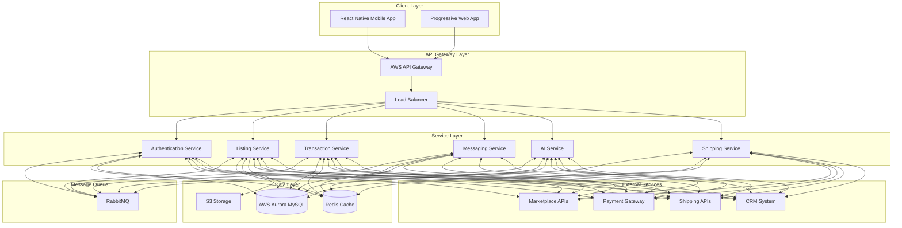
```mermaid
flowchart TD
    subgraph Client Layer
        A[React Native Mobile App]
        B[Progressive Web App]
    end

    subgraph API Gateway Layer
        C[AWS API Gateway]
        D[Load Balancer]
    end

    subgraph Service Layer
        E[Authentication Service]
        F[Listing Service]
        G[Transaction Service]
        H[Messaging Service]
        I[AI Service]
        J[Shipping Service]
    end

    subgraph Message Queue
        K[RabbitMQ]
    end

    subgraph Data Layer
        L[(AWS Aurora MySQL)]
        M[(Redis Cache)]
        N[S3 Storage]
    end

    subgraph External Services
        O[Marketplace APIs]
        P[Payment Gateway]
        Q[Shipping APIs]
        R[CRM System]
    end

    A --> C
    B --> C
    C --> D
    D --> E & F & G & H & I & J
    E & F & G & H & I & J <--> K
    E & F & G & H & I & J <--> L
    E & F & G & H & I & J <--> M
    F --> N
    E & F & G & H & I & J <--> O & P & Q & R
```

## 3.2 Component Architecture

### 3.2.1 Frontend Architecture

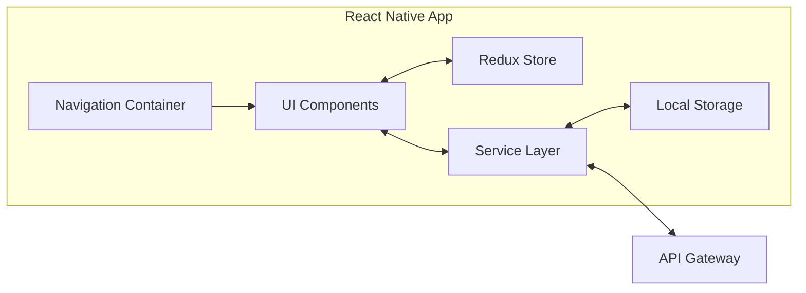
```mermaid
flowchart LR
    subgraph React Native App
        A[Navigation Container]
        B[Redux Store]
        C[UI Components]
        D[Service Layer]
        E[Local Storage]
    end

    A --> C
    C <--> B
    C <--> D
    D <--> E
    D <--> F[API Gateway]
```

### 3.2.2 Backend Service Architecture

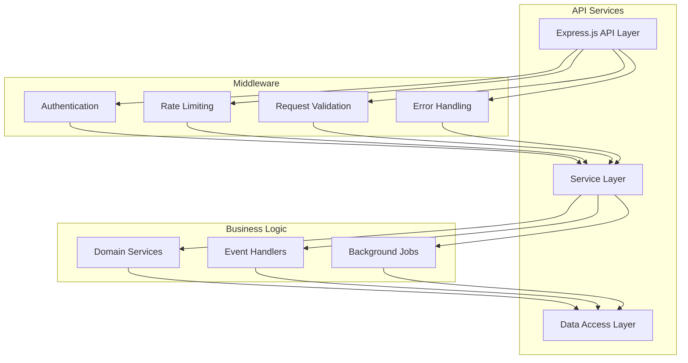
```mermaid
flowchart TD
    subgraph API Services
        A[Express.js API Layer]
        B[Service Layer]
        C[Data Access Layer]
    end

    subgraph Middleware
        D[Authentication]
        E[Rate Limiting]
        F[Request Validation]
        G[Error Handling]
    end

    subgraph Business Logic
        H[Domain Services]
        I[Event Handlers]
        J[Background Jobs]
    end

    A --> D & E & F & G
    D & E & F & G --> B
    B --> H & I & J
    H & I & J --> C
```

## 3.3 Data Flow Architecture

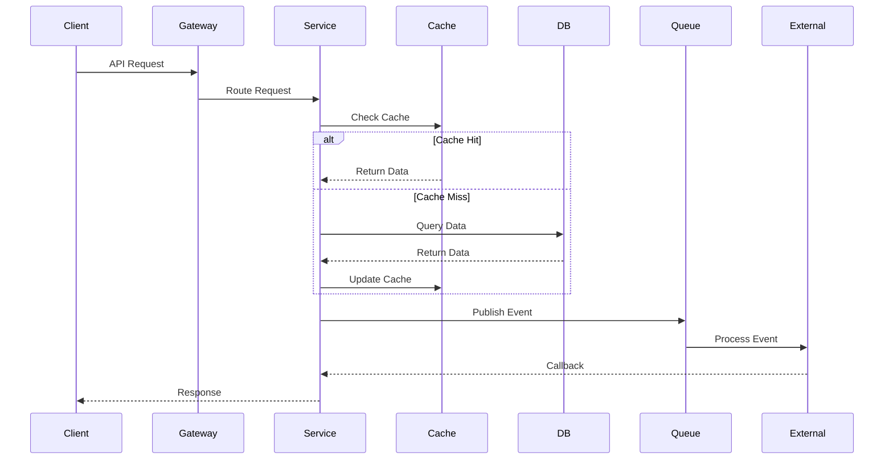
```mermaid
sequenceDiagram
    participant Client
    participant Gateway
    participant Service
    participant Cache
    participant DB
    participant Queue
    participant External

    Client->>Gateway: API Request
    Gateway->>Service: Route Request
    Service->>Cache: Check Cache
    alt Cache Hit
        Cache-->>Service: Return Data
    else Cache Miss
        Service->>DB: Query Data
        DB-->>Service: Return Data
        Service->>Cache: Update Cache
    end
    Service->>Queue: Publish Event
    Queue->>External: Process Event
    External-->>Service: Callback
    Service-->>Client: Response
```

## 3.4 Infrastructure Architecture

### 3.4.1 AWS Infrastructure

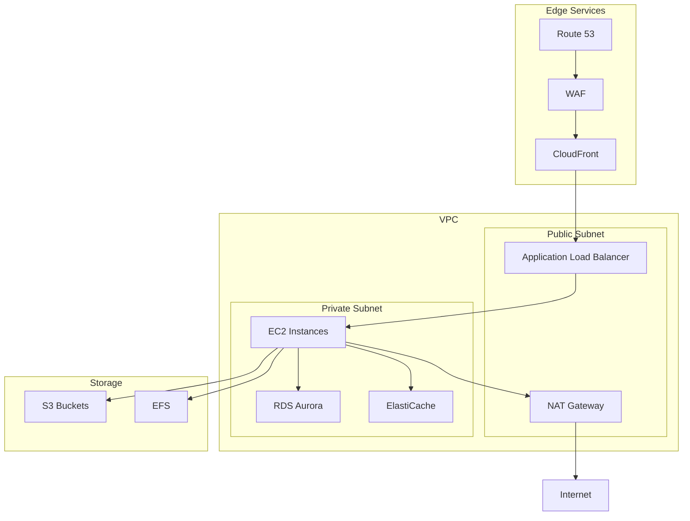
```mermaid
flowchart TD
    subgraph VPC
        subgraph Public Subnet
            A[Application Load Balancer]
            B[NAT Gateway]
        end

        subgraph Private Subnet
            C[EC2 Instances]
            D[RDS Aurora]
            E[ElastiCache]
        end
    end

    subgraph Edge Services
        F[CloudFront]
        G[Route 53]
        H[WAF]
    end

    subgraph Storage
        I[S3 Buckets]
        J[EFS]
    end

    G --> H
    H --> F
    F --> A
    A --> C
    C --> B
    B --> Internet
    C --> D & E
    C --> I & J
```

## 3.5 Security Architecture

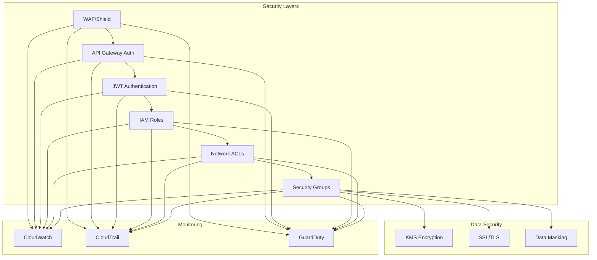
```mermaid
flowchart TD
    subgraph Security Layers
        A[WAF/Shield]
        B[API Gateway Auth]
        C[JWT Authentication]
        D[IAM Roles]
        E[Network ACLs]
        F[Security Groups]
    end

    subgraph Data Security
        G[KMS Encryption]
        H[SSL/TLS]
        I[Data Masking]
    end

    subgraph Monitoring
        J[CloudWatch]
        K[CloudTrail]
        L[GuardDuty]
    end

    A --> B --> C --> D
    D --> E --> F
    F --> G & H & I
    A & B & C & D & E & F --> J & K & L
```

## 3.6 Technology Stack

| Layer | Technology |
|-------|------------|
| Frontend | React Native, Redux, Material UI |
| Backend | Node.js, Express.js, TypeScript |
| Database | AWS Aurora MySQL, Redis |
| Message Queue | RabbitMQ |
| Storage | AWS S3, CloudFront |
| CI/CD | AWS CodePipeline, CodeBuild |
| Monitoring | CloudWatch, ELK Stack |
| Security | AWS WAF, Shield, KMS |

## 3.7 Scalability Considerations

- Horizontal scaling through Auto Scaling Groups
- Read replicas for database scaling
- CDN for static content delivery
- Caching strategy with Redis
- Message queue for asynchronous processing
- Microservices architecture for independent scaling
- Container orchestration with ECS/EKS

## 3.8 Availability and Redundancy

- Multi-AZ deployment
- Cross-region replication
- Automated failover
- Load balancing
- Circuit breakers
- Health checks
- Disaster recovery procedures

This architecture ensures high availability, scalability, and security while maintaining the flexibility to add new features and integrate with external services as the platform grows.

# 4. SYSTEM COMPONENTS ARCHITECTURE

## 4.1 Component Diagrams

### 4.1.1 Core System Components

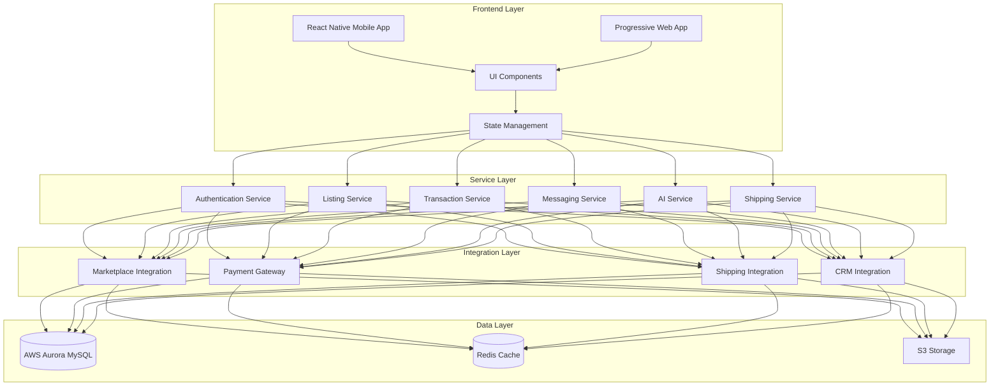
```mermaid
graph TB
    subgraph Frontend Layer
        A[React Native Mobile App]
        B[Progressive Web App]
        C[UI Components]
        D[State Management]
    end

    subgraph Service Layer
        E[Authentication Service]
        F[Listing Service]
        G[Transaction Service]
        H[Messaging Service]
        I[AI Service]
        J[Shipping Service]
    end

    subgraph Integration Layer
        K[Marketplace Integration]
        L[Payment Gateway]
        M[Shipping Integration]
        N[CRM Integration]
    end

    subgraph Data Layer
        O[(AWS Aurora MySQL)]
        P[(Redis Cache)]
        Q[S3 Storage]
    end

    A & B --> C
    C --> D
    D --> E & F & G & H & I & J
    E & F & G & H & I & J --> K & L & M & N
    K & L & M & N --> O & P & Q
```

### 4.1.2 Service Components Detail

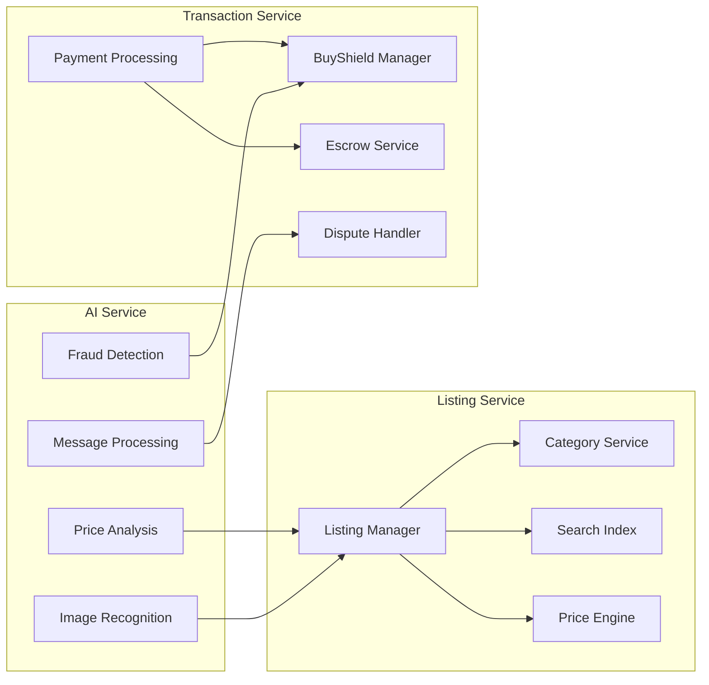
```mermaid
graph LR
    subgraph Listing Service
        A[Listing Manager]
        B[Category Service]
        C[Search Index]
        D[Price Engine]
    end

    subgraph AI Service
        E[Image Recognition]
        F[Price Analysis]
        G[Fraud Detection]
        H[Message Processing]
    end

    subgraph Transaction Service
        I[Payment Processing]
        J[BuyShield Manager]
        K[Escrow Service]
        L[Dispute Handler]
    end

    A --> B & C & D
    E & F --> A
    G --> J
    H --> L
    I --> J & K
```

## 4.2 Sequence Diagrams

### 4.2.1 Listing Creation Flow

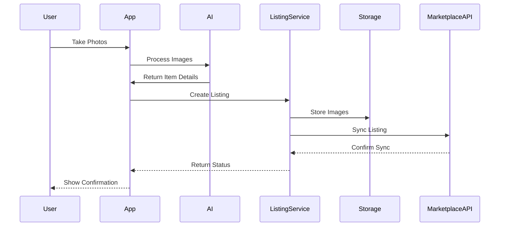
```mermaid
sequenceDiagram
    participant User
    participant App
    participant AI
    participant ListingService
    participant Storage
    participant MarketplaceAPI

    User->>App: Take Photos
    App->>AI: Process Images
    AI->>App: Return Item Details
    App->>ListingService: Create Listing
    ListingService->>Storage: Store Images
    ListingService->>MarketplaceAPI: Sync Listing
    MarketplaceAPI-->>ListingService: Confirm Sync
    ListingService-->>App: Return Status
    App-->>User: Show Confirmation
```

### 4.2.2 BuyShield Transaction Flow

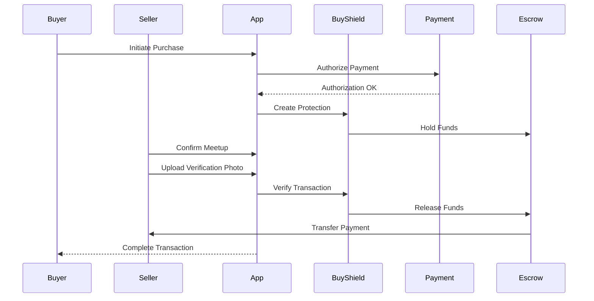
```mermaid
sequenceDiagram
    participant Buyer
    participant Seller
    participant App
    participant BuyShield
    participant Payment
    participant Escrow

    Buyer->>App: Initiate Purchase
    App->>Payment: Authorize Payment
    Payment-->>App: Authorization OK
    App->>BuyShield: Create Protection
    BuyShield->>Escrow: Hold Funds
    Seller->>App: Confirm Meetup
    Seller->>App: Upload Verification Photo
    App->>BuyShield: Verify Transaction
    BuyShield->>Escrow: Release Funds
    Escrow->>Seller: Transfer Payment
    App-->>Buyer: Complete Transaction
```

## 4.3 Data Flow Diagrams

### 4.3.1 Main Data Flow

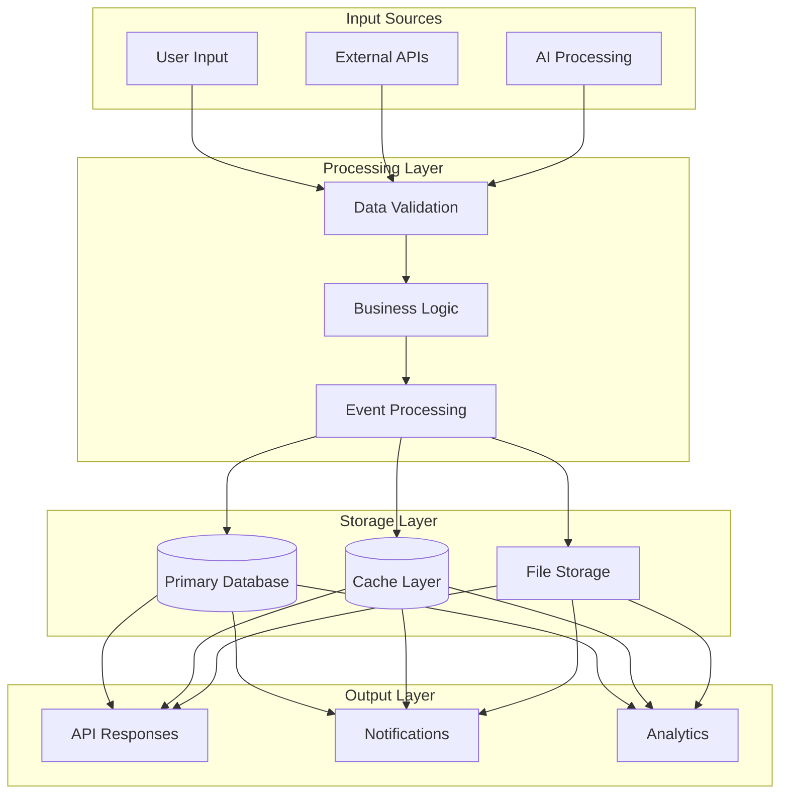
```mermaid
flowchart TD
    subgraph Input Sources
        A[User Input]
        B[External APIs]
        C[AI Processing]
    end

    subgraph Processing Layer
        D[Data Validation]
        E[Business Logic]
        F[Event Processing]
    end

    subgraph Storage Layer
        G[(Primary Database)]
        H[(Cache Layer)]
        I[File Storage]
    end

    subgraph Output Layer
        J[API Responses]
        K[Notifications]
        L[Analytics]
    end

    A & B & C --> D
    D --> E
    E --> F
    F --> G & H & I
    G & H & I --> J & K & L
```

### 4.3.2 Component Data Flow Matrix

| Component | Input Data | Processing | Output Data |
|-----------|------------|------------|-------------|
| Listing Service | Images, Item Details | AI Analysis, Validation | Listing Records |
| AI Service | Raw Images, Text | ML Models, Analysis | Structured Data |
| Transaction Service | Payment Info, User Data | Validation, Processing | Transaction Records |
| BuyShield | Transaction Data, Photos | Verification, Escrow | Protection Status |
| Messaging Service | User Messages | AI Filtering, Routing | Processed Messages |
| Shipping Service | Address Data, Item Info | Label Generation, Scheduling | Shipping Labels |

### 4.3.3 Data Store Interactions

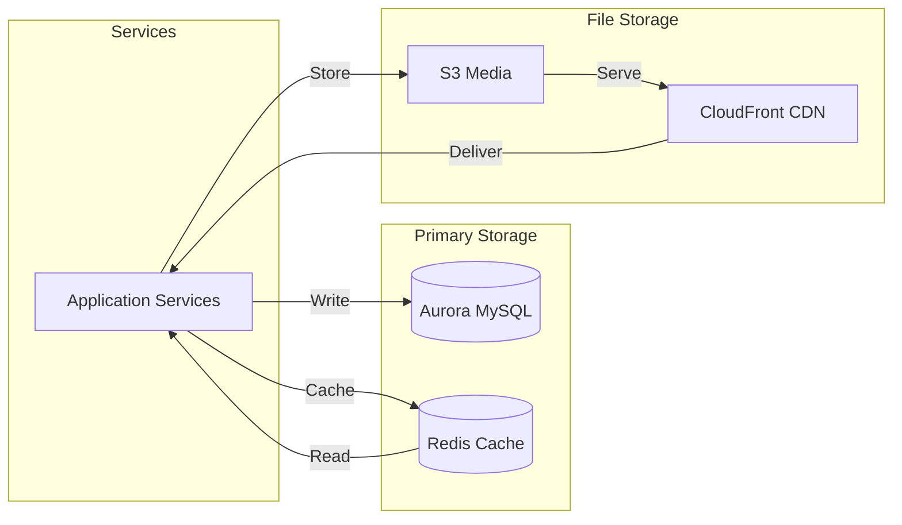
```mermaid
flowchart LR
    subgraph Services
        A[Application Services]
    end

    subgraph Primary Storage
        B[(Aurora MySQL)]
        C[(Redis Cache)]
    end

    subgraph File Storage
        D[S3 Media]
        E[CloudFront CDN]
    end

    A -->|Write| B
    A -->|Cache| C
    C -->|Read| A
    A -->|Store| D
    D -->|Serve| E
    E -->|Deliver| A
```

This architecture ensures efficient data flow while maintaining the system's scalability and reliability requirements. The component separation allows for independent scaling and maintenance of different system parts while maintaining cohesive functionality through well-defined interfaces.

# 6. TECHNOLOGY STACK

## 6.1 PROGRAMMING LANGUAGES

| Platform/Layer | Language | Justification |
|---------------|----------|---------------|
| Backend | Node.js/TypeScript | Chosen for its robust ecosystem, excellent package management, and strong typing support for maintainable code |
| Frontend (Mobile) | JavaScript/TypeScript with React Native | Enables cross-platform development while maintaining native performance |
| Database | SQL | Required for Aurora MySQL complex relational data model |
| Infrastructure | YAML, JSON | Used for AWS CloudFormation and configuration management |
| AI Services | Python | Optimal for AI/ML implementations and image processing |

## 6.2 FRAMEWORKS AND LIBRARIES

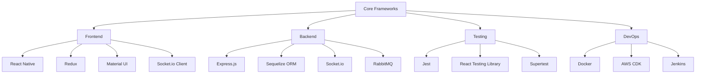
```mermaid
graph TD
    A[Core Frameworks] --> B[Frontend]
    A --> C[Backend]
    A --> D[Testing]
    A --> E[DevOps]

    B --> B1[React Native]
    B --> B2[Redux]
    B --> B3[Material UI]
    B --> B4[Socket.io Client]

    C --> C1[Express.js]
    C --> C2[Sequelize ORM]
    C --> C3[Socket.io]
    C --> C4[RabbitMQ]

    D --> D1[Jest]
    D --> D2[React Testing Library]
    D --> D3[Supertest]

    E --> E1[Docker]
    E --> E2[AWS CDK]
    E --> E3[Jenkins]
```

## 6.3 DATABASES AND STORAGE

| Type | Technology | Purpose |
|------|------------|---------|
| Primary Database | AWS Aurora MySQL | Main transactional database |
| Cache Layer | Amazon ElastiCache (Redis) | Session management, real-time data |
| Media Storage | Amazon S3 | Image and file storage |
| Search Engine | Amazon OpenSearch | Full-text search capabilities |
| Message Queue | RabbitMQ | Asynchronous task processing |

## 6.4 THIRD-PARTY SERVICES

### Authentication and Security
- AWS IAM for service authentication
- JWT for user authentication
- AWS WAF for web application firewall
- AWS Shield for DDoS protection

### Payment Processing
- Stripe API for payment processing
- Stripe Connect for marketplace payments
- Stripe Escrow for BuyShield service

### Marketplace Integration
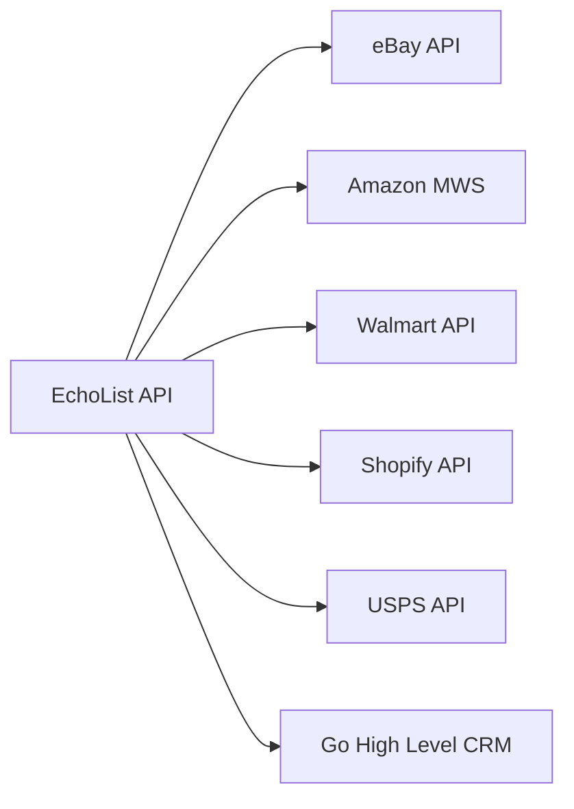
```mermaid
graph LR
    A[EchoList API] --> B[eBay API]
    A --> C[Amazon MWS]
    A --> D[Walmart API]
    A --> E[Shopify API]
    A --> F[USPS API]
    A --> G[Go High Level CRM]
```

### Cloud Infrastructure
- AWS EC2 for application hosting
- AWS ECS for container orchestration
- AWS CloudFront for CDN
- AWS Route 53 for DNS management
- AWS Certificate Manager for SSL/TLS

### Development Tools
- GitHub for version control
- Jenkins for CI/CD
- Docker for containerization
- AWS CloudWatch for monitoring
- ELK Stack for logging

### AI Services
- Custom AI models deployed on AWS SageMaker
- AWS Rekognition for image analysis
- TensorFlow for machine learning models
- OpenCV for image processing

This technology stack has been specifically chosen to support the scalability, reliability, and performance requirements outlined in the system architecture while maintaining consistency with the existing infrastructure choices documented in previous sections.

# 5. SYSTEM DESIGN

## 5.1 USER INTERFACE DESIGN

### 5.1.1 Mobile Application Layout

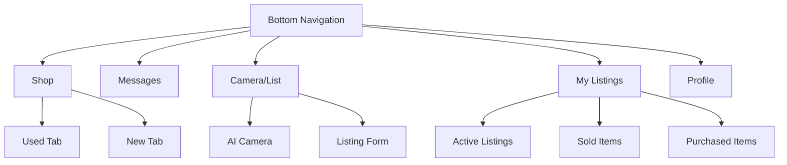
```mermaid
graph TD
    A[Bottom Navigation] --> B[Shop]
    A --> C[Messages]
    A --> D[Camera/List]
    A --> E[My Listings]
    A --> F[Profile]
    
    B --> G[Used Tab]
    B --> H[New Tab]
    
    D --> I[AI Camera]
    D --> J[Listing Form]
    
    E --> K[Active Listings]
    E --> L[Sold Items]
    E --> M[Purchased Items]
```

### 5.1.2 Core Screen Components

| Screen | Components | Functionality |
|--------|------------|---------------|
| Shop | - Dual tabs (Used/New) - Search bar - Filter button - 3-column grid - Pull-to-refresh | - Tab switching - Search functionality - Filter modal - Infinite scroll |
| Camera/List | - Camera viewfinder - AR measurement overlay - Capture button - Preview panel | - Photo capture - Dimension measurement - AI analysis - Field auto-population |
| Messages | - Conversation list - Chat interface - AI indicator - Transaction controls | - Real-time messaging - Image sharing - Offer management - AI intervention |
| My Listings | - Status tabs - Item grid - Price adjustment slider - Action buttons | - Listing management - Price updates - Status tracking - Analytics view |

## 5.2 DATABASE DESIGN

### 5.2.1 Core Schema

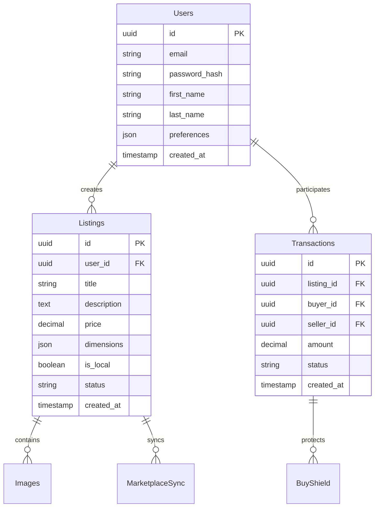
```mermaid
erDiagram
    Users ||--o{ Listings : creates
    Users ||--o{ Transactions : participates
    Listings ||--o{ Images : contains
    Listings ||--o{ MarketplaceSync : syncs
    Transactions ||--o{ BuyShield : protects
    
    Users {
        uuid id PK
        string email
        string password_hash
        string first_name
        string last_name
        json preferences
        timestamp created_at
    }
    
    Listings {
        uuid id PK
        uuid user_id FK
        string title
        text description
        decimal price
        json dimensions
        boolean is_local
        string status
        timestamp created_at
    }
    
    Transactions {
        uuid id PK
        uuid listing_id FK
        uuid buyer_id FK
        uuid seller_id FK
        decimal amount
        string status
        timestamp created_at
    }
```

### 5.2.2 Database Indexes

| Table | Index | Type | Purpose |
|-------|-------|------|---------|
| Users | email_idx | UNIQUE | Email lookup |
| Listings | user_id_idx | BTREE | User's listings |
| Listings | status_idx | BTREE | Status filtering |
| Transactions | buyer_seller_idx | BTREE | Transaction lookup |
| MarketplaceSync | external_id_idx | UNIQUE | Platform sync |

## 5.3 API DESIGN

### 5.3.1 RESTful Endpoints

| Endpoint | Method | Purpose | Request Body | Response |
|----------|--------|---------|--------------|-----------|
| /api/listings | POST | Create listing | Listing data + images | Created listing |
| /api/listings/{id} | PUT | Update listing | Updated fields | Updated listing |
| /api/transactions | POST | Create transaction | Transaction details | Transaction status |
| /api/buyshield/verify | POST | Verify pickup | Photo + metadata | Verification status |

### 5.3.2 API Flow Architecture

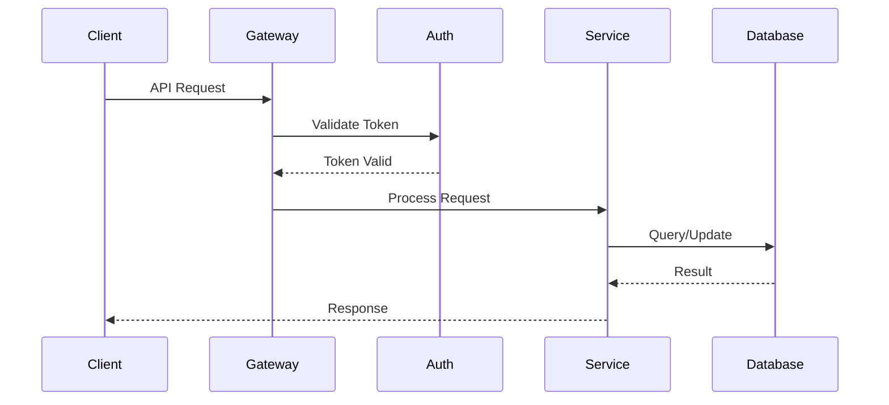
```mermaid
sequenceDiagram
    participant Client
    participant Gateway
    participant Auth
    participant Service
    participant Database
    
    Client->>Gateway: API Request
    Gateway->>Auth: Validate Token
    Auth-->>Gateway: Token Valid
    Gateway->>Service: Process Request
    Service->>Database: Query/Update
    Database-->>Service: Result
    Service-->>Client: Response
```

### 5.3.3 WebSocket Events

| Event | Direction | Purpose | Payload |
|-------|-----------|---------|---------|
| message.new | Server->Client | New message | Message object |
| transaction.update | Server->Client | Status change | Transaction status |
| listing.price_update | Server->Client | Price changed | Updated price |
| buyshield.status | Server->Client | Protection status | BuyShield status |

### 5.3.4 External API Integration

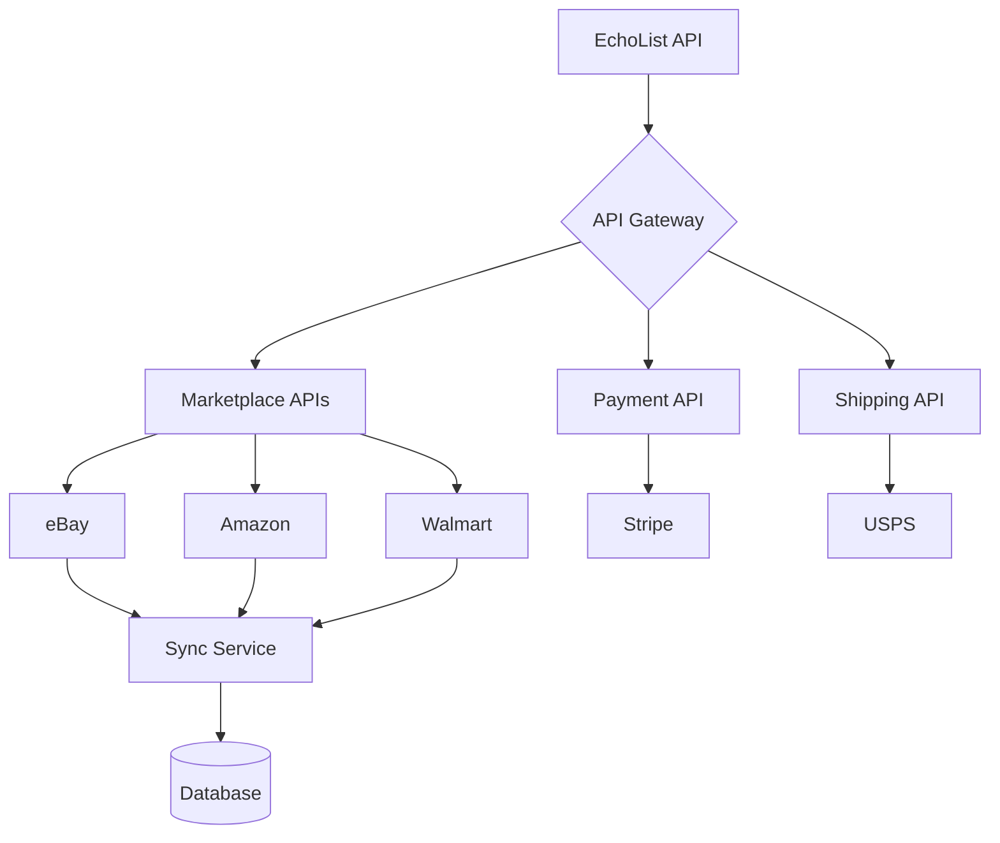
```mermaid
flowchart TD
    A[EchoList API] --> B{API Gateway}
    B --> C[Marketplace APIs]
    B --> D[Payment API]
    B --> E[Shipping API]
    
    C --> F[eBay]
    C --> G[Amazon]
    C --> H[Walmart]
    
    D --> I[Stripe]
    E --> J[USPS]
    
    F --> K[Sync Service]
    G --> K
    H --> K
    K --> L[(Database)]
```

This system design maintains consistency with the existing architecture while providing detailed specifications for the user interface, database structure, and API endpoints required for the EchoList platform.

# 7. SECURITY CONSIDERATIONS

## 7.1 AUTHENTICATION AND AUTHORIZATION

### 7.1.1 Authentication Methods

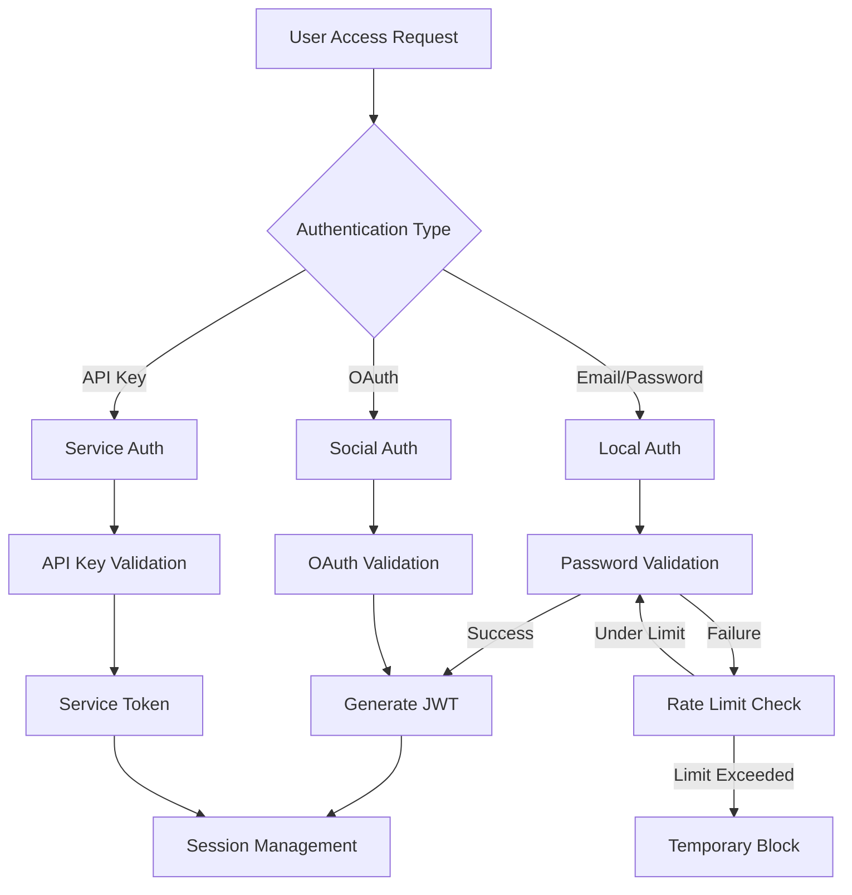
```mermaid
flowchart TD
    A[User Access Request] --> B{Authentication Type}
    B -->|Email/Password| C[Local Auth]
    B -->|OAuth| D[Social Auth]
    B -->|API Key| E[Service Auth]
    
    C --> F[Password Validation]
    F -->|Success| G[Generate JWT]
    F -->|Failure| H[Rate Limit Check]
    
    D --> I[OAuth Validation]
    I --> G
    
    E --> J[API Key Validation]
    J --> K[Service Token]
    
    G --> L[Session Management]
    K --> L
    
    H -->|Limit Exceeded| M[Temporary Block]
    H -->|Under Limit| F
```

| Authentication Type | Implementation | Security Measures |
|--------------------|----------------|-------------------|
| Local Authentication | Email/Password with bcrypt | Rate limiting, password complexity rules |
| OAuth 2.0 | Google, Facebook integration | State validation, PKCE |
| API Authentication | JWT with AWS Cognito | Key rotation, expiration policies |
| Service Accounts | API Keys with IAM roles | IP whitelisting, usage quotas |

### 7.1.2 Authorization Framework

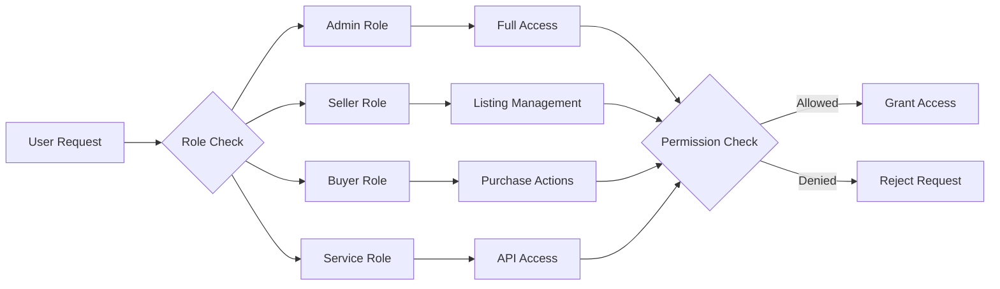
```mermaid
flowchart LR
    A[User Request] --> B{Role Check}
    B --> C[Admin Role]
    B --> D[Seller Role]
    B --> E[Buyer Role]
    B --> F[Service Role]
    
    C --> G[Full Access]
    D --> H[Listing Management]
    E --> I[Purchase Actions]
    F --> J[API Access]
    
    G --> K{Permission Check}
    H --> K
    I --> K
    J --> K
    
    K -->|Allowed| L[Grant Access]
    K -->|Denied| M[Reject Request]
```

## 7.2 DATA SECURITY

### 7.2.1 Encryption Standards

| Data Type | Encryption Method | Key Management |
|-----------|------------------|----------------|
| User Credentials | AES-256 | AWS KMS |
| Payment Information | PCI DSS compliant | Stripe Vault |
| Session Data | TLS 1.3 | AWS Certificate Manager |
| File Storage | S3 Server-side Encryption | AWS KMS with automatic rotation |
| Database | Aurora encryption at rest | AWS KMS managed keys |

### 7.2.2 Data Protection Measures

```mermaid
flowchart TD
    A[Sensitive Data] --> B{Classification}
    B -->|PII| C[Encryption at Rest]
    B -->|Financial| D[Tokenization]
    B -->|Session| E[Secure Cookie]
    
    C --> F[AWS KMS]
    D --> G[Stripe Vault]
    E --> H[Redis TLS]
    
    F --> I[Access Control]
    G --> I
    H --> I
    
    I --> J[Audit Logging]
    J --> K[CloudWatch]
```

## 7.3 SECURITY PROTOCOLS

### 7.3.1 Network Security

| Layer | Protection Measure | Implementation |
|-------|-------------------|----------------|
| Edge | AWS WAF | DDoS protection, IP filtering |
| Transport | TLS 1.3 | AWS Certificate Manager |
| Application | API Gateway | Request validation, throttling |
| Database | Security Groups | Restricted access, VPC isolation |

### 7.3.2 Security Monitoring

```mermaid
flowchart LR
    A[Security Events] --> B{Event Type}
    B -->|Access| C[IAM Logs]
    B -->|Network| D[VPC Flow Logs]
    B -->|Application| E[CloudWatch]
    B -->|Security| F[GuardDuty]
    
    C --> G[CloudTrail]
    D --> G
    E --> G
    F --> G
    
    G --> H[Security Hub]
    H --> I[Alert System]
    I --> J[Security Team]
```

### 7.3.3 Compliance Standards

| Standard | Implementation | Monitoring |
|----------|----------------|------------|
| GDPR | Data encryption, access controls | Regular audits |
| PCI DSS | Stripe integration, tokenization | Quarterly scans |
| SOC 2 | AWS compliance tools | Continuous monitoring |
| CCPA | Data privacy controls | Annual review |

### 7.3.4 Incident Response

```mermaid
flowchart TD
    A[Security Incident] --> B{Severity Level}
    B -->|High| C[Immediate Response]
    B -->|Medium| D[Standard Response]
    B -->|Low| E[Monitored Response]
    
    C --> F[System Isolation]
    C --> G[Team Notification]
    
    D --> H[Investigation]
    D --> I[Mitigation]
    
    E --> J[Logging]
    E --> K[Analysis]
    
    F --> L[Recovery Plan]
    G --> L
    H --> L
    I --> L
    J --> M[Prevention Update]
    K --> M
```

### 7.3.5 Security Update Management

| Component | Update Frequency | Process |
|-----------|-----------------|---------|
| System Packages | Weekly | Automated CI/CD |
| Dependencies | Monthly | Dependabot alerts |
| Security Patches | As needed | Emergency deployment |
| SSL Certificates | 90 days | Auto-renewal |
| Access Keys | 90 days | Automated rotation |

This security architecture ensures comprehensive protection of the EchoList platform while maintaining compliance with industry standards and regulations. It leverages AWS security services and implements multiple layers of protection for both data and system access.

# 8. INFRASTRUCTURE

## 8.1 DEPLOYMENT ENVIRONMENT

The EchoList platform will be deployed entirely on AWS cloud infrastructure to leverage its scalability, reliability, and extensive service ecosystem. The deployment strategy follows a multi-environment approach:

| Environment | Purpose | Configuration |
|-------------|----------|--------------|
| Development | Feature development and testing | Single AZ, minimal redundancy |
| Staging | Pre-production testing and validation | Multi-AZ, production-like setup |
| Production | Live system serving end users | Multi-AZ, full redundancy, DR enabled |

```mermaid
flowchart TD
    subgraph Production
        A[Primary Region] --> B[DR Region]
        subgraph Primary
            C[AZ-1] --- D[AZ-2]
        end
        subgraph DR
            E[AZ-1] --- F[AZ-2]
        end
    end
    subgraph Non-Production
        G[Development] --> H[Staging]
    end
```

## 8.2 CLOUD SERVICES

AWS services selected for the EchoList platform:

| Service | Purpose | Justification |
|---------|---------|---------------|
| EC2 | Application hosting | Flexible compute resources with auto-scaling |
| ECS | Container orchestration | Native AWS container management |
| RDS Aurora | Database | High availability, automated failover |
| ElastiCache | Caching layer | In-memory caching for performance |
| S3 | Object storage | Scalable storage for media files |
| CloudFront | CDN | Global content delivery |
| Route 53 | DNS management | Reliable DNS with health checks |
| WAF | Web application firewall | Security and DDoS protection |
| KMS | Key management | Encryption key management |
| CloudWatch | Monitoring | Comprehensive system monitoring |

## 8.3 CONTAINERIZATION

Docker containerization strategy:

```mermaid
flowchart LR
    subgraph Container Architecture
        A[Frontend Container] --> D[Nginx]
        B[Backend Container] --> E[Node.js]
        C[Worker Container] --> F[Queue Processing]
    end
    subgraph Base Images
        G[Node Alpine] --> A & B & C
        H[Nginx Alpine] --> D
    end
```

| Component | Base Image | Purpose |
|-----------|------------|----------|
| Frontend | node:alpine | React Native web build |
| Backend | node:alpine | Express.js API services |
| Workers | node:alpine | Background job processing |
| Nginx | nginx:alpine | Reverse proxy and static serving |

## 8.4 ORCHESTRATION

ECS orchestration configuration:

```mermaid
flowchart TD
    subgraph ECS Cluster
        A[Application Load Balancer]
        subgraph Service 1
            B[Frontend Task]
            C[Frontend Task]
        end
        subgraph Service 2
            D[Backend Task]
            E[Backend Task]
        end
        subgraph Service 3
            F[Worker Task]
            G[Worker Task]
        end
    end
    A --> B & C
    A --> D & E
```

| Service | Configuration | Scaling Policy |
|---------|---------------|----------------|
| Frontend | 2-4 tasks, t3.small | CPU > 70% |
| Backend | 2-6 tasks, t3.medium | Request count |
| Workers | 1-4 tasks, t3.small | Queue length |

## 8.5 CI/CD PIPELINE

```mermaid
flowchart LR
    A[GitHub] --> B[CodePipeline]
    B --> C{Build Stage}
    C --> D[CodeBuild]
    D --> E{Test Stage}
    E --> F[Unit Tests]
    E --> G[Integration Tests]
    F & G --> H{Deploy Stage}
    H --> I[Development]
    I --> J[Staging]
    J --> K[Production]
```

Pipeline stages and configurations:

| Stage | Tools | Actions |
|-------|-------|---------|
| Source | GitHub | Code checkout, webhook triggers |
| Build | CodeBuild | Docker image building, artifact creation |
| Test | Jest, Cypress | Unit tests, integration tests |
| Security | SonarQube | Code quality, security scanning |
| Deploy | CodeDeploy | Blue-green deployment |
| Verify | CloudWatch | Health checks, monitoring |

Deployment strategy:

- Blue-green deployments for zero-downtime updates
- Automated rollback on health check failures
- Environment-specific configuration management
- Automated database migrations
- Integration with AWS Secrets Manager for credentials
- CloudWatch alarms for deployment monitoring

This infrastructure design ensures high availability, scalability, and maintainable deployment processes while maintaining consistency with the existing technology choices documented in previous sections.

# APPENDICES

## A. ADDITIONAL TECHNICAL INFORMATION

### A.1 Development Environment Setup

```mermaid
flowchart TD
    A[Development Setup] --> B[Local Environment]
    A --> C[Staging Environment]
    A --> D[Production Environment]
    
    B --> E[Docker Containers]
    B --> F[Local Database]
    B --> G[Mock Services]
    
    C --> H[AWS Test Resources]
    C --> I[Test Data]
    C --> J[CI/CD Pipeline]
    
    D --> K[AWS Production]
    D --> L[Live Data]
    D --> M[Monitoring]
```

### A.2 Testing Strategy

| Level | Tools | Scope | Frequency |
|-------|-------|-------|-----------|
| Unit Testing | Jest, React Testing Library | Individual components | On every commit |
| Integration Testing | Cypress | API interactions | Daily |
| E2E Testing | Detox | Full user flows | Pre-release |
| Performance Testing | Artillery | Load testing | Weekly |
| Security Testing | OWASP ZAP | Vulnerability scanning | Monthly |

### A.3 Deployment Pipeline

```mermaid
flowchart LR
    A[Code Push] --> B[Build]
    B --> C[Test]
    C --> D[Security Scan]
    D --> E[Stage]
    E --> F[UAT]
    F --> G[Deploy]
    G --> H[Monitor]
```

## B. GLOSSARY

| Term | Definition |
|------|------------|
| BuyShield | EchoList's proprietary escrow service for local transactions |
| Dual-Tab Marketplace | Split interface showing separate 'Used' and 'New' item sections |
| AI Camera Tool | Automated item measurement and photo capture system |
| Marketplace Sync | Real-time inventory synchronization across multiple platforms |
| SKU Matching | Product identification and matching across different marketplaces |
| Authorization Hold | Temporary payment hold during BuyShield transactions |
| Box Drop-off | USPS service for delivering shipping boxes to sellers |
| Listing Priority | System for prioritizing EchoList listings in search results |

## C. ACRONYMS

| Acronym | Full Form |
|---------|-----------|
| API | Application Programming Interface |
| AWS | Amazon Web Services |
| CDN | Content Delivery Network |
| CI/CD | Continuous Integration/Continuous Deployment |
| CRM | Customer Relationship Management |
| DDoS | Distributed Denial of Service |
| EC2 | Elastic Compute Cloud |
| ECS | Elastic Container Service |
| ELB | Elastic Load Balancer |
| IAM | Identity and Access Management |
| JWT | JSON Web Token |
| KMS | Key Management Service |
| PCI | Payment Card Industry |
| RDS | Relational Database Service |
| S3 | Simple Storage Service |
| SDK | Software Development Kit |
| SES | Simple Email Service |
| SSL | Secure Sockets Layer |
| TLS | Transport Layer Security |
| UI/UX | User Interface/User Experience |
| USPS | United States Postal Service |
| VPC | Virtual Private Cloud |
| WAF | Web Application Firewall |

## D. EXTERNAL SERVICE DEPENDENCIES

```mermaid
flowchart TD
    subgraph Cloud Services
        A[AWS Infrastructure]
        B[CloudFront CDN]
        C[S3 Storage]
    end
    
    subgraph Payment Services
        D[Stripe API]
        E[Payment Processing]
        F[Escrow Service]
    end
    
    subgraph Marketplace APIs
        G[eBay API]
        H[Amazon API]
        I[Walmart API]
    end
    
    subgraph Shipping Services
        J[USPS API]
        K[Label Generation]
        L[Pickup Scheduling]
    end
    
    A --> B & C
    D --> E & F
    G & H & I --> A
    J --> K & L
```

## E. ERROR CODES AND HANDLING

| Code Range | Category | Description | Handling Strategy |
|------------|----------|-------------|------------------|
| 1000-1999 | Authentication | User auth related errors | Redirect to login |
| 2000-2999 | Transaction | Payment/escrow issues | Notify support team |
| 3000-3999 | Marketplace | Platform sync errors | Retry with backoff |
| 4000-4999 | Shipping | Label/pickup failures | Alternative options |
| 5000-5999 | AI Services | Processing errors | Fallback to manual |
| 9000-9999 | System | Infrastructure issues | Auto-failover |